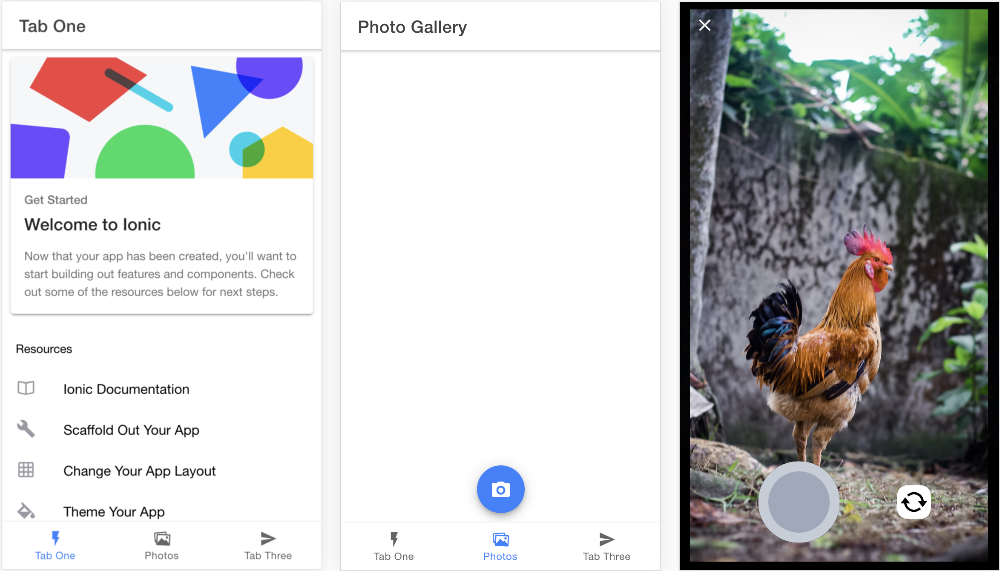

 A photo gallery app built with Ionic React and Capacitor in Javascript.
 You can click and upload images instantly

## Overview

This app is the JavaScript transpile of [Ionic React Photo Gallery App](https://github.com/ionic-team/photo-gallery-capacitor-react) organized to work without a build step by using,

* [ESM Modules](https://developer.mozilla.org/en-US/docs/Web/JavaScript/Guide/Modules) and
* [Import Maps](https://github.com/WICG/import-maps).

## Contributions

Happy to accept external contributions to the project in the form of feedback, bug reports and even better - pull requests

